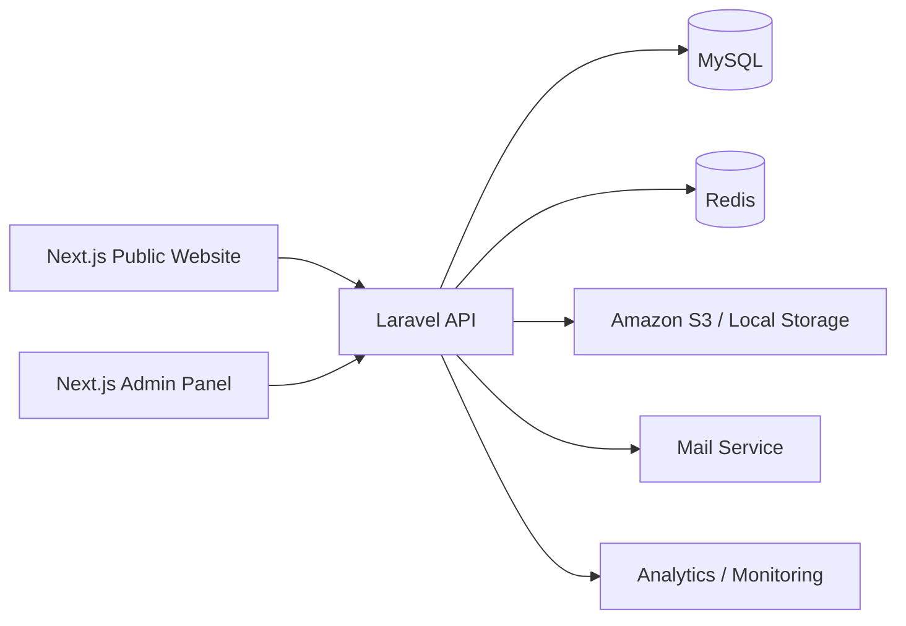
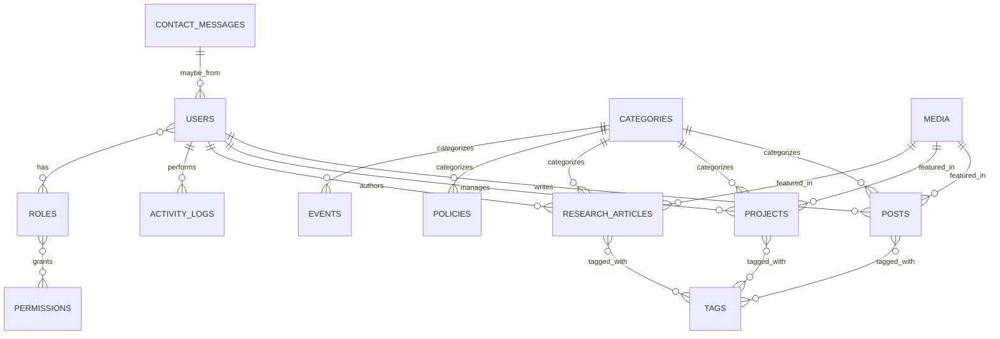

# Modern Scalable Website + Admin Panel Architecture

## 1. Executive Summary
This architecture proposes a modular, secure, and production-ready platform built with:
- Frontend: Next.js, React, TypeScript, Tailwind CSS
- Admin Panel: Next.js + React + TypeScript
- Backend: Laravel 11+ with REST API
- Database: MySQL
- Authentication: Laravel Sanctum
- State Management: TanStack Query + Context API
- File Storage: Local storage for development, Amazon S3 for production
- Cache: Redis (optional but recommended)

The platform is designed for a public-facing website with a dedicated admin panel, clean architecture boundaries, reusable modules, and enterprise-grade security.

---

## 2. System Architecture

### High-Level Overview



### Recommended Architecture Layers

1. Presentation Layer
- Public website UI
- Admin panel UI
- Shared reusable components

2. Application Layer
- Services
- Use cases
- DTOs / request validation
- API controllers

3. Domain Layer
- Models
- Business rules
- Enums
- Value objects

4. Infrastructure Layer
- Database repositories
- File storage adapters
- Email services
- Cache providers

### Clean Architecture Principles
- Separation of concerns
- Dependency inversion
- Reusable domain logic
- Modular feature folders
- API-first design
- Testable services and controllers

---

## 3. Recommended Project Structure

```text
/website
  /apps
    /frontend            # Public website (Next.js)
    /admin               # Admin panel (Next.js)
  /backend
    /laravel             # Laravel REST API
    /app
      /Http
        /Controllers
        /Requests
      /Models
      /Services
      /Repositories
      /Exceptions
      /Policies
      /Notifications
    /database
      /migrations
      /seeders
      /factories
    /routes
      /api.php
    /config
    /tests
  /packages
    /shared-ui           # Reusable UI components
    /shared-types        # TypeScript types/interfaces
    /api-client          # API client layer
    /utils               # Common utilities
  /docs
    /architecture.md
    /api.md
  /storage
    /app
    /framework
    /logs
  /config
    /nginx.conf
    /docker-compose.yml
    /env.example
```

### Frontend Folder Structure
```text
/apps/frontend
  /app
    /(public)
    /about
    /impact
    /projects
    /research
    /policy-hub
    /media
    /speaking
    /opportunities
    /blog
    /contact
    /api
  /components
    /common
    /layout
    /sections
    /forms
  /hooks
  /lib
  /services
  /types
  /styles
  /public
```

### Admin Folder Structure
```text
/apps/admin
  /app
    /dashboard
    /users
    /content
    /settings
    /media
    /analytics
  /components
    /layout
    /tables
    /forms
    /modals
    /charts
  /hooks
  /services
  /stores
  /types
```

### Backend Folder Structure
```text
/backend/laravel
  /app
    /Http/Controllers/Api/V1
    /Http/Requests/V1
    /Models
    /Services
    /Repositories
    /Policies
    /Notifications
    /Enums
  /database/migrations
  /database/seeders
  /routes/api.php
  /tests/Feature
```

---

## 4. Core Content Model
A shared content pattern should be used for most public modules.

### Common Content Fields
Every content-based module should include:
- id
- title
- slug
- excerpt
- content
- status (draft/published)
- is_featured
- featured_image
- gallery_images
- seo_title
- seo_description
- og_image
- published_at
- author_id
- category_id
- created_at
- updated_at
- deleted_at

This pattern supports:
- SEO
- draft/publish workflow
- media association
- categories and tags
- soft delete and restore

---

## 5. Database Design

### Core Tables

#### Authentication & Users
- users
- roles
- permissions
- role_user
- permission_role
- password_resets
- personal_access_tokens

#### Global Content & Settings
- categories
- tags
- media
- settings
- menus
- menu_items
- seo_meta
- faqs
- testimonials
- partners
- announcements
- activity_logs
- subscribers
- newsletters

#### Public Website Modules
- pages
- posts
- projects
- research_articles
- policies
- media_items
- events
- opportunities
- contacts
- contact_messages
- comments
- documents

### Recommended Table Design

#### users
- id (PK)
- name
- email (unique)
- password
- avatar
- status
- email_verified_at
- remember_token
- created_at
- updated_at
- deleted_at

#### roles
- id (PK)
- name
- slug
- description
- created_at
- updated_at

#### permissions
- id (PK)
- name
- slug
- group
- created_at
- updated_at

#### categories
- id (PK)
- name
- slug
- type
- parent_id
- description
- status
- created_at
- updated_at

#### tags
- id (PK)
- name
- slug
- created_at
- updated_at

#### media
- id (PK)
- file_name
- original_name
- mime_type
- size
- disk
- path
- type
- alt_text
- uploaded_by
- created_at
- updated_at

#### pages
- id (PK)
- title
- slug
- content
- page_type
- banner_image
- status
- seo_title
- seo_description
- og_image
- featured_image
- is_featured
- created_by
- updated_by
- published_at
- created_at
- updated_at
- deleted_at

#### posts
- id (PK)
- title
- slug
- excerpt
- content
- category_id (FK)
- author_id (FK)
- status
- featured_image
- is_featured
- seo_title
- seo_description
- og_image
- published_at
- created_at
- updated_at
- deleted_at

#### projects
- id (PK)
- name
- slug
- category_id (FK)
- summary
- description
- objectives
- activities
- timeline
- location
- status
- featured_image
- gallery_images
- documents
- seo_title
- seo_description
- og_image
- start_date
- end_date
- created_by
- created_at
- updated_at
- deleted_at

#### research_articles
- id (PK)
- title
- slug
- summary
- content
- category_id (FK)
- author_id (FK)
- file_path
- download_count
- status
- featured_image
- is_featured
- seo_title
- seo_description
- og_image
- published_at
- created_at
- updated_at
- deleted_at

#### policies
- id (PK)
- title
- slug
- summary
- content
- category_id (FK)
- document_path
- status
- featured_image
- seo_title
- seo_description
- og_image
- published_at
- created_at
- updated_at
- deleted_at

#### media_items
- id (PK)
- title
- slug
- type
- content
- featured_image
- gallery_images
- status
- category_id (FK)
- published_at
- created_at
- updated_at
- deleted_at

#### events
- id (PK)
- title
- slug
- description
- event_date
- location
- category_id (FK)
- featured_image
- gallery_images
- status
- seo_title
- seo_description
- og_image
- created_at
- updated_at
- deleted_at

#### opportunities
- id (PK)
- title
- slug
- type
- description
- application_deadline
- application_link
- location
- status
- featured_image
- seo_title
- seo_description
- og_image
- created_at
- updated_at
- deleted_at

#### contact_messages
- id (PK)
- name
- email
- subject
- message
- status
- ip_address
- created_at
- updated_at

#### activity_logs
- id (PK)
- user_id (FK)
- action
- module
- description
- ip_address
- created_at

### Relationships
- users 1..N posts
- users 1..N projects
- users 1..N research_articles
- categories 1..N posts/projects/research_articles/policies/media_items/events
- posts N..N tags
- projects N..N tags
- media 1..N content modules
- pages 1..N seo_meta

### Indexes
- users.email unique
- posts.slug unique
- projects.slug unique
- research_articles.slug unique
- policies.slug unique
- contact_messages.status indexed
- activity_logs.user_id indexed
- category.type indexed
- published_at indexed

### Migration Structure
```text
/database/migrations/2026_07_17_001_create_roles_table.php
/database/migrations/2026_07_17_002_create_permissions_table.php
/database/migrations/2026_07_17_003_create_users_table.php
/database/migrations/2026_07_17_004_create_categories_table.php
/database/migrations/2026_07_17_005_create_tags_table.php
/database/migrations/2026_07_17_006_create_media_table.php
/database/migrations/2026_07_17_007_create_pages_table.php
/database/migrations/2026_07_17_008_create_posts_table.php
/database/migrations/2026_07_17_009_create_projects_table.php
/database/migrations/2026_07_17_010_create_research_articles_table.php
/database/migrations/2026_07_17_011_create_policies_table.php
/database/migrations/2026_07_17_012_create_media_items_table.php
/database/migrations/2026_07_17_013_create_events_table.php
/database/migrations/2026_07_17_014_create_opportunities_table.php
/database/migrations/2026_07_17_015_create_contact_messages_table.php
/database/migrations/2026_07_17_016_create_activity_logs_table.php
```

---

## 6. ER Diagram



---

## 7. API Design

### Base URL
```text
https://api.example.com/api/v1
```

### Authentication Routes
- POST /auth/register
- POST /auth/login
- POST /auth/logout
- GET /auth/me
- POST /auth/refresh

### Module API Structure
Each module should support:
- GET /{module}
- GET /{module}/{id}
- POST /{module}
- PUT /{module}/{id}
- DELETE /{module}/{id}
- GET /{module}/search?q=
- GET /{module}?status=published&category_id=1&page=1&per_page=15

### Module Endpoints
- /dashboard
- /users
- /roles
- /permissions
- /home
- /about
- /impact
- /projects
- /research
- /policy-hub
- /media
- /speaking
- /opportunities
- /blog
- /contact
- /settings
- /seo
- /upload

### API Standards
- JSON response format
- Consistent pagination structure
- Validation errors with field-level messages
- Role-based authorization middleware
- Soft-delete support
- Search and filtering query parameters
- API versioning via /v1

### Example Response
```json
{
  "success": true,
  "data": {
    "items": [],
    "pagination": {
      "current_page": 1,
      "per_page": 15,
      "total": 120,
      "last_page": 8
    }
  },
  "message": "Posts retrieved successfully"
}
```

---

## 8. Admin Panel Module Breakdown

### Dashboard
Widgets:
- Total visitors
- Total posts
- Total projects
- Total research articles
- Total blog posts
- Contact messages
- Opportunities
- Recent activities
- Quick statistics
- Charts and analytics

### User Management
- Users
- Roles
- Permissions
- Profile
- Password management

### Content Management Modules
- Home management
- About management
- Impact management
- Projects management
- Research management
- Policy Hub management
- Media management
- Speaking management
- Opportunities management
- Blog management
- Contact management

### Global Modules
- Categories
- Tags
- Media library
- File manager
- Menu builder
- Header/footer management
- Site settings
- SEO settings
- Social media settings
- Newsletter/subscribers
- Testimonials
- Partners
- FAQs
- Announcements
- Activity logs
- Backup management

---

## 9. Public Website Module Breakdown

### 1. Home
- Hero/banner
- Featured sections
- Statistics
- CTA blocks
- Testimonials
- Partners
- SEO metadata

### 2. About
- Organization info
- Vision, mission
- Team members
- Leadership
- Timeline
- SEO metadata

### 3. Impact
- Impact stories
- Success stories
- Statistics
- Reports
- Images/videos

### 4. Projects
- Project listing and details
- Category/filter/search
- Gallery and documents
- SEO metadata

### 5. Research
- Research papers
- Publications
- Authors
- Downloadable files
- Featured research
- SEO metadata

### 6. Policy Hub
- Policies
- Guidelines
- White papers
- Legal documents
- Download support
- Category and tag filtering

### 7. Media
- News
- Press releases
- Photo gallery
- Video gallery
- Media coverage
- Downloads

### 8. Speaking
- Events
- Conferences
- Talks
- Interviews
- Upcoming speaking engagements
- Gallery

### 9. Opportunities
- Job circulars
- Internships
- Fellowships
- Volunteer opportunities
- Application links and deadlines

### 10. Blog
- Categories
- Tags
- Authors
- Rich text content
- Featured image
- Comments
- Related posts
- SEO support

### 11. Contact
- Contact information
- Office address
- Google map
- Contact form submissions
- Email settings
- Social links

---

## 10. Navigation Structure

### Public Navigation
- Home
- About
- Impact
- Projects
- Research
- Policy Hub
- Media
- Speaking
- Opportunities
- Blog
- Contact

### Admin Navigation
- Dashboard
- Users
- Roles & Permissions
- Home Management
- About Management
- Impact Management
- Projects Management
- Research Management
- Policy Hub Management
- Media Management
- Speaking Management
- Opportunities Management
- Blog Management
- Contact Management
- Settings
- SEO
- Analytics
- Activity Logs

---

## 11. User Roles & Permissions

### Roles
- Super Admin
- Admin
- Editor
- Moderator
- Contributor
- Viewer

### Permissions
- manage_users
- manage_roles
- manage_content
- manage_media
- manage_settings
- manage_contact_messages
- publish_content
- delete_content
- view_reports
- export_data
- manage_backup

### RBAC Approach
- Use Laravel policies for authorization
- Centralize permission checks in middleware
- Keep role-based access consistent across admin and API

---

## 12. UI/UX Wireframe Suggestions

### Public Website UI
- Sticky header with clear navigation
- Hero section with CTA
- Content cards for modules
- Search and filter panels
- Clean typography and spacing
- Mobile-first responsive design
- SEO-friendly page layouts

### Admin Panel UI
- Sidebar navigation
- Top bar with search, notifications, profile
- Dashboard cards and analytics charts
- Data tables with filters and bulk actions
- Form layout with tabs and validation states
- Modal dialogs for create/edit flows
- Breadcrumbs and status badges
- Dark mode support

### Suggested Components
- DataTable
- FormBuilder
- RichTextEditor
- ImageUploader
- FileManagerModal
- ConfirmDeleteModal
- StatusBadge
- SearchBar
- Pagination
- ChartCard

---

## 13. Technical Stack Decisions

### Frontend
- Next.js latest
- React + TypeScript
- Tailwind CSS
- TanStack Query for server state
- Context API for UI/global state
- Next SEO or metadata API for SEO

### Backend
- Laravel latest
- REST API with resource controllers
- Form requests for validation
- Services and repositories for business logic
- API Resources for clean JSON output
- Sanctum for authentication

### Database
- MySQL 8+
- Foreign keys and indexes
- Soft deletes for content safety
- Audit trail logging

### Storage
- Development: local file storage
- Production: Amazon S3
- Image optimization via Next.js Image and Laravel image processing

### Cache
- Redis for caching public content and session data

---

## 14. Security Best Practices

### Authentication & Authorization
- Laravel Sanctum for API authentication
- Password hashing using bcrypt/Argon2
- MFA support for admins
- Fine-grained RBAC
- Session rotation and secure cookies

### Input Protection
- Validation at request layer
- Prepared statements and ORM usage
- CSRF protection on web forms
- XSS protection via sanitization and escaping
- Rate limiting on login and public APIs

### File Upload Security
- Restrict allowed file types
- Validate MIME type and size
- Scan uploads where possible
- Store files outside public web root when needed
- Rename files to safe unique names

### Audit & Logging
- Log all admin actions
- Track content changes and deletions
- Capture login attempts and suspicious activity

---

## 15. Deployment Architecture

### Recommended Deployment Stack
- Frontend: Vercel or similar
- Admin Panel: Vercel or separate hosting
- Backend API: Laravel on VPS, Docker, or cloud service
- Database: Managed MySQL
- Storage: S3 for media files
- Cache: Redis managed service
- SSL/TLS enabled
- CDN for static assets

### Production Environment Setup
- Separate staging and production environments
- Environment variables managed securely
- CI/CD pipelines with automated testing
- Database backups scheduled
- Monitoring and alerting configured

---

## 16. Scalability Strategy

### Performance
- Server-side rendering for public pages
- Incremental static regeneration where suitable
- CDN caching for static assets
- Redis caching for frequent reads
- Pagination and query optimization
- Lazy loading for images and media

### Maintainability
- Feature-based modules
- Reusable services and UI components
- Consistent coding standards
- Unit and feature tests
- Shared API client and typing package

### Growth Roadmap
- Multi-language support
- Multisite support
- Headless CMS expansion
- Search engine integration
- Webhooks and integrations

---

## 17. Suggested Implementation Phases

### Phase 1
- Project scaffolding
- Authentication and RBAC
- Basic public pages
- Admin dashboard
- CRUD for core modules

### Phase 2
- SEO metadata and media manager
- Search and filtering
- File uploads and S3 integration
- Activity logs and notifications

### Phase 3
- Advanced analytics
- Newsletter and subscriptions
- Export features and backup management
- Performance optimization and monitoring

---

## 18. Recommended Development Standards
- Follow PSR-12 for Laravel code
- Use TypeScript strict mode in frontend
- Enforce ESLint and Prettier
- Write unit and feature tests
- Use form requests and API resources
- Follow DRY and SOLID principles
- Keep business logic out of controllers

---

## 19. Final Recommendation
The best structure for this project is a decoupled architecture with:
- A Next.js public website for fast, SEO-friendly content delivery
- A separate Next.js admin app for management workflows
- A Laravel backend as the secure API and business logic layer
- MySQL as the main relational store
- S3 and Redis for scalable media and caching

This combination provides a modern, scalable, secure, and maintainable foundation that can grow into a full enterprise content platform.
